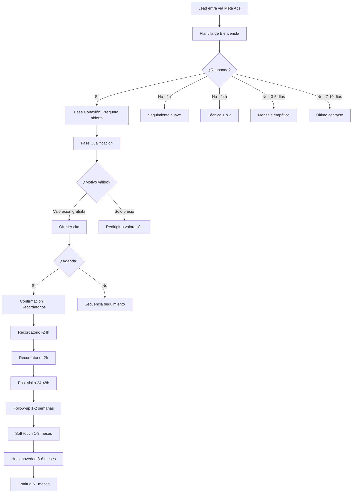

# 🏥 Estrategia WhatsApp AI Agent — Coco Clínics

> Estrategia completa basada en el análisis de los cursos **"Pacientes en Visto"** y **"Cash Injection"** de ClinicSkool. Adaptada para una clínica de medicina estética con leads procedentes de Meta Ads.

---

## 1. 📩 Plantilla de Bienvenida (Mejorar tasa de apertura)

### ❌ Error habitual
Enviar un "tochón" de texto con información de la clínica, tratamientos y precios. **El lead ve un bloque de texto ➜ no lo abre.**

### ✅ Principios clave (del curso)
- **Cuanto más frío está el lead, menos debes hablar de tratamientos/precios** y más de conexión personal
- El primer mensaje debe ser **corto, personal y con una pregunta abierta** (lo que el curso llama "Pregunta de Conexión")
- **NO dar información sin que la pidan** → primero genera conversación

### 🎯 Plantillas de bienvenida optimizadas

#### Opción A: Pregunta de conexión directa
```
Hola {{nombre}} 👋

Soy [nombre asesora] de Coco Clínics.

He visto que te has interesado por nuestros tratamientos.

¿Es para algo concreto que te gustaría mejorar o todavía
estás explorando opciones? 😊
```

#### Opción B: Hook de "resultados naturales" (mayor conversión en estética)
```
Hola {{nombre}} 👋

Soy [nombre asesora] de Coco Clínics.

Vi tu interés en nuestros tratamientos de medicina estética.

¿Buscas un resultado natural para algo que llevas tiempo
queriendo mejorar o es algo más reciente? 🌿
```

#### Opción C: Mensaje ultra-corto (máxima apertura)
```
Hola {{nombre}} 👋

Vi tu solicitud. ¿Es para ti o para alguien más?
```

> [!TIP]
> **Truco para aumentar apertura:** El primer mensaje de la plantilla de WhatsApp solo muestra las primeras ~2 líneas en la preview. Esas 2 líneas deben generar curiosidad suficiente para abrir. Evita empezar con "Somos Coco Clínics, una clínica de..." → aburre.

---

## 2. 💬 Flujo de Conversación del Agente (Mejorar tasa de agendamiento)

### Filosofía del curso
> *"El problema no es que no tengan dinero. El problema es lo que les mandas."*

El agente debe seguir un flujo conversacional de **4 fases**, NO responder directamente con precios o información.

### Fase 1: Conexión (1er mensaje)
**Objetivo:** Que el lead responda. Nada más.

```
Hola {{nombre}} 👋 Soy [nombre] de Coco Clínics.
¿Es para algo concreto que te gustaría mejorar o todavía estás
explorando opciones?
```

### Fase 2: Cualificación (tras la primera respuesta)
**Objetivo:** Identificar si el motivo es válido para valoración gratuita.

```
¡Genial! Me encanta que quieras [lo que ha mencionado].
¿Llevas tiempo pensándolo o es algo que has notado más
recientemente?
```

Seguido de:
```
Perfecto. En Coco Clínics lo primero que hacemos es una
valoración gratuita y sin compromiso con nuestra doctora
para ver si eres buena candidata y qué opciones se adaptan
mejor a ti. ¿Te gustaría que te buscara un hueco esta semana?
```

> [!IMPORTANT]
> **Filtro de "candidata":** El curso destaca que preguntar *"¿Eres buena candidata?"* en vez de *"¿Quieres una cita?"* genera **más autoridad y más citas**, porque posiciona a la clínica como la que decide, no el paciente.

### Fase 3: Agenda
**Objetivo:** Cerrar la cita.

```
Tenemos disponibilidad el [día 1] a las [hora] o el [día 2]
a las [hora]. ¿Cuál te viene mejor?
```

Si duda del precio:
```
Entiendo 😊 La valoración es totalmente gratuita.
Es simplemente para que la doctora valore tu caso,
te explique opciones y tú decidas sin presión.
¿Qué día te iría mejor?
```

### Fase 4: Confirmación
```
¡Perfecto! 🎉 Quedas agendada:
📅 [Día], [Fecha] a las [Hora]
📍 Coco Clínics — [dirección]

Te enviaré un recordatorio el día antes.
¿Tienes alguna duda antes de tu cita?
```

### Reglas para el agente IA

| Regla | Descripción |
|-------|-------------|
| **Nunca dar precios directamente** | Siempre redirigir a la valoración gratuita |
| **No enviar "tochones"** | Máximo 3-4 líneas por mensaje |
| **Preguntar antes de informar** | Primero entender qué busca, después ofrecer |
| **Usar el hook "resultado natural"** | Es el mayor driver de conversión en estética |
| **Usar la técnica del "1 o 2"** | Si no responde: "Dime 1 si te interesa, 2 si prefieres dejarlo" |

---

## 3. ⏰ Mensajes de Recordatorio (Reducir no-shows)

### Secuencia recomendada

#### 📌 Recordatorio 1 — 24h antes de la cita
```
Hola {{nombre}} 😊

Te recuerdo que mañana tienes tu valoración gratuita
en Coco Clínics:

📅 [Día, Fecha] a las [Hora]
📍 [Dirección]

¿Nos vemos mañana? ✅
```

#### 📌 Recordatorio 2 — 2h antes de la cita
```
¡Hola {{nombre}}! 👋

Te esperamos hoy a las [Hora] en Coco Clínics.
¿Todo bien para venir? 😊
```

#### 📌 Si no confirma el recordatorio de 24h
```
{{nombre}}, ¿sigue en pie lo de mañana?
Dime un 1 si vienes o un 2 si necesitas cambiar el día 🙏
```

> [!TIP]
> **La "Regla del 1 o 2"** (del curso): Pedir una respuesta tan simple como un número elimina la fricción. El lead no tiene que redactar nada. Esto aumenta drásticamente la tasa de confirmación.

### Frecuencia óptima

| Momento | Acción |
|---------|--------|
| Inmediatamente tras agendar | Confirmación con detalles |
| 24h antes | Recordatorio + pregunta de confirmación |
| 2h antes | Recordatorio final breve |
| Si no confirma en 24h | Usar técnica "1 o 2" |

---

## 4. 🔄 Seguimiento: Lead que NO agenda o NO responde

### Principio del curso
> *"Los leads que no responden no están perdidos. Son una mina de oro porque ya te conocen."*

### Secuencia de seguimiento

#### ⏱️ A las 2-4 horas (si no responde al primer mensaje)
```
{{nombre}}, por si no te llegó bien mi mensaje anterior...
¿Tienes un minutito? Solo quería saber si puedo ayudarte 😊
```

#### ⏱️ A las 24 horas
```
Hola {{nombre}}, no quiero ser pesada 😅
Solo quería asegurarme de que viste mi mensaje.
¿Te interesa que te cuente cómo es la valoración gratuita?
Dime un 1 si sí, un 2 si ahora no es buen momento 🙏
```

#### ⏱️ A los 3-5 días
```
{{nombre}}, pensé en ti hoy 😊
Si en algún momento quieres retomar lo de la valoración,
solo dime y te busco un hueco. Sin prisa ✨
```

#### ⏱️ A los 7-10 días (último intento)
```
Hola {{nombre}}, ¿cómo estás?
No te voy a escribir más para no molestarte, pero quería
que supieras que si algún día decides dar el paso,
aquí me tienes. ¡Un abrazo! 💛

PD: Si quieres que te avise cuando haya promociones
o novedades, dime un "sí" y te apunto 😊
```

### Para leads que preguntaron precio y desaparecieron
> *"Cada semana te escriben personas interesadas. Y cada semana la mayoría desaparece después de tu respuesta. El problema no es que no tengan dinero. El problema es lo que les mandas."*

```
Hola {{nombre}}, ¿cómo estás?
Me quedé con ganas de ayudarte con lo que me comentaste.
¿Es algo que sigue interesándote o has encontrado otra solución?
```

### Para presupuestos enviados sin respuesta

#### Menos de 72h:
```
{{nombre}}, no hace falta que me respondas un testamento 😊
Solo dime con un 1 si todavía te interesa o con un 2 si
prefieres dejarlo para más adelante.
```

#### Si el freno es económico:
```
{{nombre}}, entiendo que estos tratamientos requieren pensarlo bien.
Si lo que te frena es el momento económico, tenemos opciones de
pago fraccionado que igual no te comenté bien. ¿Te cuento?
```

#### Semanas/meses después (reactivación):
```
{{nombre}}, esta semana tuve un caso muy parecido al tuyo
y pensé en ti. ¿Cómo estás llevando lo de [problema concreto]?
```

---

## 5. 🌟 Seguimiento Post-Visita

### Filosofía
> *"No te escribo para ofrecerte nada. Solo para darte las gracias."*

### Secuencia post-visita

#### ⏱️ 24-48h después de la visita
```
Hola {{nombre}} 😊
¿Cómo estás después de tu visita en Coco Clínics?
Quería asegurarme de que todo va bien.
¿Alguna duda sobre lo que comentamos? 💛
```

#### ⏱️ 1-2 semanas (si se hizo tratamiento)
```
{{nombre}}, ¿cómo vas con los resultados?
Me encantaría saber cómo te estás viendo.
Si notas cualquier cosa que te preocupe, me dices ☺️
```

#### ⏱️ 1-3 meses (soft touch)
```
Hola {{nombre}}, pensé en ti hoy sin motivo especial.
¿Cómo estás? ¿Cómo va todo con [tratamiento que se hizo]? 😊
```

#### ⏱️ 3-6 meses (hook de novedad)
```
{{nombre}}, pensé en ti esta semana.
Acabamos de incorporar algo nuevo para [su zona de interés]
que creo que te puede interesar mucho. ¿Te cuento? ✨
```

#### ⏱️ 6+ meses (gratitud pura)
```
Hola {{nombre}}, no te escribo para ofrecerte nada.
Solo quería darte las gracias por haber confiado en
Coco Clínics. Si algún día quieres retomar, aquí estamos 💛
```

### Para reactivar pacientes inactivos (campaña masiva)
```
Hola {{nombre}}, ¿cómo estás?
Te escribo porque acabamos de abrir la agenda para [mes]
y como ya has venido a la clínica, queríamos darte prioridad
para que no te quedes sin tu hueco.
¿Te gustaría que te buscara un hueco para [tratamiento]?
```

> [!TIP]
> **Palanca psicológica de "prioridad"** (del curso): Dar al paciente la sensación de exclusividad ("te damos prioridad") activa urgencia sin ser agresivo.

---

## 6. 🧠 Resumen de Principios Clave (Curso ClinicSkool)

| Principio | Aplicación |
|-----------|------------|
| **"Pregunta de Conexión"** | Siempre abrir con pregunta, nunca con información |
| **Regla del "1 o 2"** | Simplificar la respuesta al máximo para leads fríos |
| **"Resultado natural"** | El hook con mayor conversión en estética médica |
| **Filtro de "candidata"** | Posiciona a la clínica como autoridad, no como vendedora |
| **"No enviar tochones"** | Mensajes cortos (3-4 líneas máx.) = más respuestas |
| **Gratitud > Venta** | En reactivación, agradecer funciona mejor que vender |
| **Confianza transferida** | Usar antes/después de casos similares como prueba social |
| **Timing inteligente** | Nunca contactar en días de mucho ruido (Navidad exacta, etc.) |
| **Prioridad y escasez** | "Te damos prioridad" activa urgencia sin presión |

---

## 7. 📋 Configuración Recomendada para n8n

### Flujo del agente IA



### Nodos clave para n8n

| Nodo | Trigger | Acción |
|------|---------|--------|
| **Welcome** | Nuevo lead Meta | Enviar plantilla bienvenida |
| **Follow-up 1** | Sin respuesta 2-4h | Mensaje suave |
| **Follow-up 2** | Sin respuesta 24h | Técnica "1 o 2" |
| **Follow-up 3** | Sin respuesta 3-5 días | Mensaje empático |
| **Follow-up 4** | Sin respuesta 7-10 días | Último contacto |
| **Reminder 1** | Cita -24h | Recordatorio + confirmación |
| **Reminder 2** | Cita -2h | Recordatorio final |
| **Post-visit 1** | Visita +24-48h | Check-up |
| **Post-visit 2** | Visita +1-2 sem | Resultado |
| **Reactivation** | Visita +1-3 meses | Soft touch |
| **Novelty hook** | Visita +3-6 meses | Novedad relevante |
| **Gratitude** | Visita +6 meses | Agradecimiento |

---

> [!NOTE]
> Toda esta estrategia está basada en los principios extraídos de los cursos **"Pacientes en Visto"** y **"Cash Injection"** de ClinicSkool. Los scripts están adaptados para **Coco Clínics** como clínica de medicina estética con leads de Meta Ads cuyo objetivo es agendar una **valoración gratuita**.
